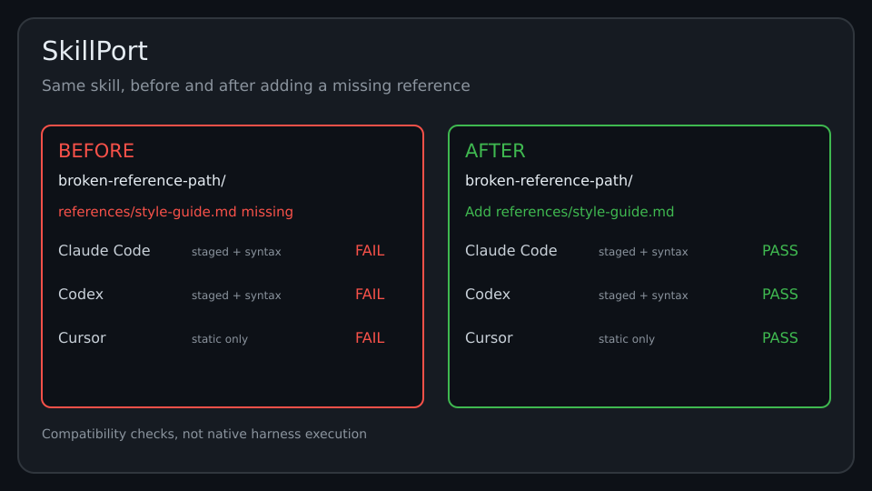

# SkillPort

**One agent skill. Every harness. Know exactly where it breaks.**

SkillPort is a portability test for agent skills. Point it at one skill folder
(`SKILL.md` + `references/` + `scripts/`) and it checks format compatibility for Claude Code, Codex and Cursor. For
Claude Code and Codex it also stages and re-loads the skill in a sandbox and
syntax-checks known script types. It does not run the native harness CLIs.



A skill may pass one set of checks yet fail another. SkillPort catches
known compatibility errors before you publish. Cursor checks are static only.

## Quickstart

Requires Node.js 18+.

```bash
git clone https://github.com/helenanova/skillport.git
cd skillport
npm install

# test your skill
npx skillport check path/to/my-skill

# see it judge the bundled examples
npx skillport fixtures
```

Exit code is `0` when all selected SkillPort checks pass, `1` on a detected
error - so it drops straight into CI:

```yaml
# .github/workflows/skillport.yml in a repository containing skills/my-skill/
name: Skill portability
on: [push, pull_request]
jobs:
  check:
    runs-on: ubuntu-latest
    steps:
      - uses: actions/checkout@v4
      - uses: actions/setup-node@v4
        with:
          node-version: 22
      - run: git clone --depth 1 https://github.com/helenanova/skillport.git "$RUNNER_TEMP/skillport"
      - run: npm ci --prefix "$RUNNER_TEMP/skillport"
      - run: node "$RUNNER_TEMP/skillport/bin/skillport.js" check ./skills/my-skill
```

Replace `./skills/my-skill` with the path to your skill. This checks the current
SkillPort main branch, so pin a commit or tag for reproducible CI after reviewing it.

## What it checks

**Format checks (all harnesses)**

- `SKILL.md` exists and its frontmatter parses
- required `name` / `description` keys, name slug format and length caps
- every referenced file (`references/...`, `scripts/...`, markdown links) exists
- no absolute or machine-specific paths, no escaping the skill directory

**Harness rules**

| Harness | Mode in this MVP | What is verified |
| --- | --- | --- |
| Claude Code | static + smoke | directory/name keying, `allowed-tools` shape, staged load, scripts |
| Codex | static + smoke | strict manifest parse, slug rules, staged load, scripts |
| Cursor | static only | conversion to `.mdc` is possible (description, non-empty body) |

**Smoke test** (MVP definition): the skill is copied into a throwaway sandbox
at the path the harness expects (`~/.claude/skills/<name>`, `~/.codex/skills/<name>`),
re-loaded through the same discovery rules, and known script types get an
interpreter check plus a syntax check (`node --check`, `python3 -m py_compile`,
`bash -n`). Staging is emulated, so CI needs no vendor accounts; if a harness
CLI is installed locally SkillPort notes it. Native CLI invocations and
sandboxed script execution are on the roadmap below.

## Reports

```bash
npx skillport check my-skill --json       # machine-readable
npx skillport check my-skill --markdown   # GitHub-Flavored Markdown
npx skillport check my-skill --out report.md
```

The repo's own CI publishes the Markdown report for all twenty bundled fixtures
to the GitHub Actions job summary on every push.

## The twenty fixtures

`fixtures/` ships the failures we kept hitting by hand, so the tool is tested
against real breakage: missing `SKILL.md`, broken reference paths, missing
frontmatter, invalid names, absolute paths, script syntax errors, oversized
descriptions, declared-but-missing scripts, escaping symlinks and spec field
limits - plus known-good skills.
`npm run check:fixtures` asserts every fixture produces its expected verdict.

## Generated output paths

Absolute paths fail by default. If a skill deliberately writes a generated file
under `/tmp/`, declare that exact file path:

```bash
npx skillport check my-skill --output-path /tmp/report.html
```

Repeat `--output-path` for multiple outputs. Each declaration emits a warning;
it does not prove that the skill only writes to that path. Declaring an input
as an output can hide a real dependency. Only exact normalized `/tmp/` file
paths are accepted, not directories or globs; unused declarations fail.
Markdown-linked absolute dependencies, parent escapes and escaping symlinks
still fail. Examples inside code fences can still be mistaken for dependencies.

## What SkillPort is not

Not a marketplace, not a security scanner, not a skill registry. It answers
"do these portability checks pass?" and stops there.

## Roadmap

- Native harness CLI smoke tests when `claude` / `codex` are present
- Sandboxed script execution (not just syntax checks) with timeouts
- More harnesses (Windsurf, Amp, OpenCode)
- `--fix` to auto-repair the common failures (missing refs, name format)

## Known MVP trade-offs

- The frontmatter parser covers scalar keys, block lists, and one-level
  `metadata` mappings, not full YAML.
- Cursor support is static-only: Cursor consumes skills as converted rules,
  and the converter itself is on the roadmap.

## License

MIT
